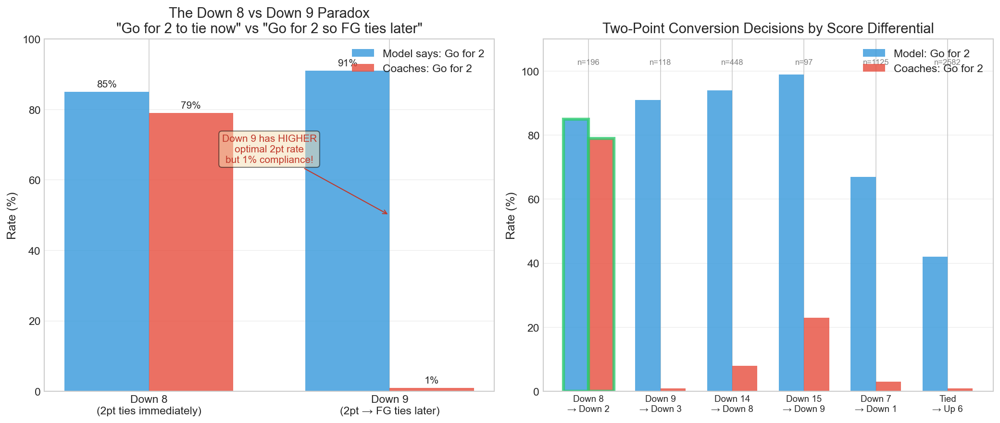

# Go For It: Bayesian Decision Theory for NFL Fourth Down and Two-Point Decisions

A fully Bayesian decision-theoretic framework for analyzing fourth down and two-point conversion decisions in the NFL.

**Author:** Andrew Bai (University of Chicago)

---

## Overview

This project develops a rigorous framework for evaluating NFL coaching decisions. Unlike existing approaches that rely on point estimates, this framework:

1. Optimizes **win probability** directly (not expected points)
2. Propagates **parameter uncertainty** through to decision uncertainty via fully Bayesian inference
3. Uses **hierarchical Bayes** to capture team-specific and kicker-specific effects with empirical Bayes shrinkage
4. Incorporates **in-game context features** (goal-to-go, EPA, drive momentum) that explain apparent "coach intuition"
5. Tests **real-time knowability** via expanding window estimation

---

## Key Findings

### Fourth Down Decisions (2006-2024)

Using nflfastR's win probability model with proper state-transition calculations:

- **Optimal GO rate: 46.6%** — but coaches only go 14.8%
- **4th & 1 optimal GO: 70.8%** — coaches go only ~25%
- **Match rate: 52.5%** — coaches make the wrong call roughly half the time
- When model says GO but teams don't: **-0.0108 WPA** (teams lose value)
- When model says GO and teams do: **+0.0059 WPA** (teams gain value)
- Conversion rate when following GO recommendation: **52.9%**
- **Teams are systematically too conservative**, leaving wins on the table

### Two-Point Conversions: The Down 8 vs Down 9 Paradox

When down 8, coaches go for 2 at 79% (model says 85%). When down 9, coaches go for 2 at **1%** (model says **91%**). Down 9 has a *higher* optimal rate, yet coaches almost never do it.



**Why is Down 9 optimal for going for 2?** The decision tree below shows the math:

- After TD from down 9, you're **down 3**
- **PAT path**: 94% → Down 2 (need TD to be comfortable); 6% → Down 3 (FG ties)
- **2pt path**: 48% → Down 1 (FG wins!); 52% → Down 3 (FG ties)

The key insight: **WP(Down 1) > WP(Down 2)** because any score wins when down 1, but you need a TD when down 2.

```
                    DOWN 3
                (after TD from down 9)
                 /            \
              PAT           GO FOR 2
               |                 |
         ┌─────┴─────┐      ┌────┴────┐
        94%         6%    48%       52%
         |           |      |         |
      DOWN 2     DOWN 3  DOWN 1   DOWN 3
     WP = 41%   WP = 35% WP = 48% WP = 35%

E[WP|PAT] = 0.94 × 0.41 + 0.06 × 0.35 = 40.6%
E[WP|2pt] = 0.48 × 0.48 + 0.52 × 0.35 = 41.2%

DIFFERENCE: +0.6% → GO FOR 2 IS BETTER
```

**Behavioral explanation**: Present bias—going for 2 when down 8 ties the game *now*; going for 2 when down 9 sets up a future tying field goal. Coaches respond to the immediate payoff ("tie now") rather than the deferred but superior payoff ("FG ties later")

### Model Validation: WPA Evidence

The nflfastR model recommendations are validated by actual Win Probability Added:

| Scenario | WPA | N Plays |
|----------|-----|---------|
| Model says GO, team goes | **+0.0059** | 6,854 |
| Model says GO, team doesn't | **-0.0009** | 26,617 |
| Model says DON'T GO, team goes | -0.0011 | 3,737 |

On 4th & 1 specifically:
- Model says GO and team goes: **+0.0125 WPA**
- Model says GO but team doesn't: **-0.0108 WPA**

**Conclusion**: Following aggressive recommendations yields positive outcomes; conservative play leaves value on the table.

---

## Mathematical Framework

### State Space

The game state is represented as:

$$s = (\Delta, \tau, x, d, h, k_1, k_2)$$

where $\Delta$ is score differential, $\tau$ is time remaining (seconds), $x$ is field position (yards from opponent's end zone), $d$ is yards to go, $h$ is the half, and $k_1, k_2$ are timeouts remaining for each team.

### Action Space

On fourth down, the coach chooses from:

$$\mathcal{A} = \lbrace\texttt{go}, \texttt{punt}, \texttt{fg}\rbrace$$

### Bayesian Expected Win Probability

For action $a$ in state $s$, expected win probability integrating over parameter uncertainty:

$$\mathbb{E}[W \mid a, s] = \int W(s' \mid a, s, \theta) \cdot p(\theta \mid \mathcal{D}) \, d\theta$$

For the action `go`, this expands to:

$$\mathbb{E}[W \mid \texttt{go}, s] = \int \left[\pi(d; \theta) \cdot W(s_{\text{convert}}) + (1 - \pi(d; \theta)) \cdot W(s_{\text{fail}})\right] \cdot p(\theta \mid \mathcal{D}) \, d\theta$$

where $s_{\text{convert}}$ and $s_{\text{fail}}$ are the successor states conditional on conversion or failure.

**Bayes-optimal decision:**

$$a^* = \arg\max_{a \in \mathcal{A}} \mathbb{E}[W \mid a, s]$$

### Decision Confidence

The posterior probability that action $a$ is optimal:

$$\mathbb{P}(a \text{ is optimal} \mid s, \mathcal{D}) = \mathbb{P}_{\theta \mid \mathcal{D}}\left(W_a(s; \theta) > \max_{a' \neq a} W_{a'}(s; \theta)\right)$$

This is estimated by Monte Carlo: draw $\theta^{(m)} \sim p(\theta \mid \mathcal{D})$ for $m = 1, \ldots, M$, compute win probabilities under each draw, and calculate the fraction of draws for which the action is optimal.

---

## Full Hierarchical Model Structure

The model has three levels: (i) observations, (ii) unit-level parameters, and (iii) hyperparameters governing partial pooling.

### Level 1: Observation Model

For observation $i$ with yards to go $d_i$, goal-to-go indicator $g_i$, in-game EPA $e_i$, drive play count $p_i$, offensive team $j[i]$, and defensive team $k[i]$, the outcome $y_i \in \lbrace 0, 1 \rbrace$ follows:

$$y_i \mid \beta, \gamma, \delta \sim \text{Bernoulli}(\pi_i), \quad \text{logit}(\pi_i) = \mathbf{x}_i^\top \beta + \gamma_{j[i]}^{\text{off}} + \delta_{k[i]}^{\text{def}}$$

where $\mathbf{x}_i = (1, d_i, g_i, e_i, p_i)^\top$ and $\beta = (\alpha, \beta_d, \beta_g, \beta_e, \beta_p)^\top$.

### Level 2: Unit-Level Priors

The team-specific effects are drawn from normal distributions centered at zero:

$$\gamma_j^{\text{off}} \sim \mathcal{N}(0, \tau_{\text{off}}^2), \quad j = 1, \ldots, J$$

$$\delta_k^{\text{def}} \sim \mathcal{N}(0, \tau_{\text{def}}^2), \quad k = 1, \ldots, K$$

This induces partial pooling: teams with few observations are shrunk toward the population mean, while teams with many observations retain estimates closer to their sample averages.

### Level 3: Hyperpriors and Population Parameters

The population-level coefficients receive weakly informative priors:

$$\beta \sim \mathcal{N}(\mathbf{0}, \sigma_\beta^2 \mathbf{I}), \quad \sigma_\beta^2 = 100$$

The variance components $\tau_{\text{off}}^2$ and $\tau_{\text{def}}^2$ are estimated via empirical Bayes (method of moments):

$$\hat{\tau}^2 = \max\left\lbrace 0, \text{Var}(\hat{\gamma}_j^{\text{raw}}) - \overline{\text{SE}^2}\right\rbrace$$

where $\hat{\gamma}_j^{\text{raw}}$ are the unpooled team effects and $\overline{\text{SE}^2}$ is the average squared standard error.

### Joint Likelihood

The full data likelihood, conditional on all parameters:

$$\mathcal{L}(\beta, \gamma, \delta) = \prod_{i} \pi_i^{y_i} (1 - \pi_i)^{1 - y_i}$$

where $\pi_i = \sigma(\mathbf{x}_i^\top \beta + \gamma_{\text{off}[i]} + \delta_{\text{def}[i]})$ and $\sigma(\cdot)$ is the logistic function.

### Posterior Distribution

By Bayes' theorem, the joint posterior is proportional to the likelihood times the priors:

$$p(\beta, \gamma, \delta \mid \mathbf{y}) \propto \mathcal{L}(\beta, \gamma, \delta) \cdot p(\beta) \cdot \left[\prod_j p(\gamma_j)\right] \cdot \left[\prod_k p(\delta_k)\right]$$

### Laplace Approximation

We approximate the posterior as Gaussian around the maximum a posteriori (MAP) estimate:

$$p(\theta \mid \mathbf{y}) \approx \mathcal{N}(\hat{\theta}_{\text{MAP}}, \mathbf{H}^{-1})$$

where $\mathbf{H}$ is the Hessian of the negative log-posterior evaluated at the MAP. For logistic regression with reasonable sample sizes, the Bernstein-von Mises theorem guarantees this approximation is asymptotically exact. Posterior samples are drawn as $\theta^{(m)} \sim \mathcal{N}(\hat{\theta}_{\text{MAP}}, \mathbf{H}^{-1})$ for Monte Carlo integration.

### Empirical Bayes Shrinkage

Given the estimated $\hat{\tau}^2$, the shrinkage factor for unit $j$ with standard error $\text{SE}_j$ is:

$$B_j = \frac{\text{SE}_j^2}{\text{SE}_j^2 + \hat{\tau}^2}$$

The shrunk estimate is $\hat{\gamma}_j = (1 - B_j) \hat{\gamma}_j^{\text{raw}}$, with posterior variance $(1 - B_j) \text{SE}_j^2$. Units with large standard errors (few observations) shrink heavily toward zero; units with small standard errors retain estimates close to their raw values.

---

## Component Models

### Hierarchical Conversion Model

**Likelihood:**

$$\mathbb{P}(\text{convert} \mid d, g, e, p, \text{off} = j, \text{def} = k) = \sigma(\alpha + \beta_d d + \beta_g g + \beta_e e + \beta_p p + \gamma_j^{\text{off}} + \delta_k^{\text{def}})$$

**Features:**
- $d$ = yards to go
- $g$ = goal-to-go indicator
- $e$ = standardized in-game EPA (team's cumulative rush + pass EPA in that game)
- $p$ = standardized drive play count
- $\gamma_j^{\text{off}} \sim \mathcal{N}(0, \tau_{\text{off}}^2)$ = offensive team random effect
- $\delta_k^{\text{def}} \sim \mathcal{N}(0, \tau_{\text{def}}^2)$ = defensive team random effect

**Population-level estimates:** $\hat{\alpha} = 0.722$, $\hat{\beta}_d = -0.133$, $\hat{\beta}_g = -1.129$ (goal-to-go *hurts*), $\hat{\beta}_e = 0.490$, $\hat{\beta}_p = 1.201$

**Key finding**: Goal-to-go situations convert at *lower* rates. At 4th & 1, conversion probability drops from 64.3% (non-goal-to-go) to 36.8% (goal-to-go)—a 27.5pp penalty.

| Yards to Go | Conversion % | 95% CI |
|-------------|--------------|--------|
| 1 | 64.3% | [63.0%, 65.6%] |
| 2 | 61.2% | [60.0%, 62.4%] |
| 3 | 58.0% | [56.9%, 59.1%] |
| 5 | 51.4% | [50.3%, 52.4%] |
| 10 | 35.2% | [33.4%, 36.8%] |

### Hierarchical Field Goal Model

**Likelihood:**

$$\mathbb{P}(\text{make} \mid d, \text{kicker} = j) = \sigma(\alpha + \beta (d - 35) + \gamma_j)$$

**Hierarchical structure:**
- $\gamma_j \sim \mathcal{N}(0, \tau^2)$ = kicker-specific effect
- Distance centered at 35 yards for numerical stability

**Population-level estimates:**
- $\hat{\alpha} = 2.383$ (SE: 0.056)
- $\hat{\beta} = -0.105$ (SE: 0.004)
- Between-kicker variance: $\hat{\tau}^2 = 0.031$

### Hierarchical Punt Model

**Likelihood:**

$$Y \mid x, \text{punter} = j \sim \mathcal{N}(\alpha + \beta x + \gamma_j, \sigma^2)$$

where $Y$ is net punt yards, $x$ is field position, and $\gamma_j$ is the punter-specific effect.

**Hierarchical structure:**
- $\gamma_j \sim \mathcal{N}(0, \tau^2)$ = punter-specific effect
- Punters with few observations shrink toward the population mean

**Population-level estimates:**
- $\hat{\alpha} = 32.8$ (SE: 0.41)
- $\hat{\beta} = 0.154$ (SE: 0.006)
- $\hat{\sigma} = 9.3$ yards
- Between-punter variance: $\hat{\tau}^2 = 1.84$, implying punter SD of 1.36 yards

### Win Probability Model

Win probability is estimated using a **Bayesian logistic regression** with 10 features:
- Score differential, time remaining, field position
- Timeout differential
- Interaction terms (score×time, field position×time)
- Binary indicators for late-game ($\tau < 300$s), winning, losing
- **Home field advantage** (is_home coefficient: 0.33)

**Key coefficients:**
- score_diff: 3.38 (dominates WP)
- time_remaining: -0.20
- score_time_interaction: -2.18
- field_pos: -0.44
- is_home: 0.33 (home team advantage)

**Validation:** Model fitted via Laplace approximation with proper uncertainty quantification.

---

## Real-Time Knowability

A natural objection: perhaps coaches couldn't have known the optimal decision at the time.

We implement an **expanding window analysis** with a 7-year minimum training window. For each test year $Y$:
1. Train models on data from 1999 through $Y-1$ only (the "ex ante" model)
2. Compute optimal decisions under the ex ante model
3. Compare to ex post (full sample) recommendations

**Result:** 93.6% agreement between ex ante and ex post recommendations across 71,786 plays.

This means hindsight explains almost nothing—the information to make optimal decisions was available in real-time.

---

## Project Structure

```
├── analysis/
│   ├── decision_framework.py      # Core Bayesian decision analysis
│   ├── decision_categorization.py # Mistake classification
│   ├── two_point_analysis.py      # Two-point conversion analysis
│   ├── expanding_window_analysis.py # Real-time knowability tests
│   └── era_comparison.py          # Temporal trends analysis
├── models/
│   ├── bayesian_models.py         # Conversion, punt, FG, WP models
│   └── hierarchical_off_def_model.py # Offense/defense effects
├── data/
│   └── acquire_data.py            # Data acquisition via nflfastR
├── slides/
│   └── slides.tex                 # Beamer presentation
└── outputs/
    ├── figures/                   # Generated visualizations
    └── tables/                    # Generated tables
```

## Data

Play-by-play data from 1999-2024 NFL seasons via [nflfastR](https://www.nflfastr.com/).

- **71,786 fourth-down situations** (2006-2024 evaluation sample)
- 7-year minimum training window for expanding window analysis

## Requirements

```
python >= 3.8
numpy
pandas
scipy
scikit-learn
pyarrow
tqdm
```

## Usage

```python
from analysis.decision_framework import BayesianDecisionAnalyzer, GameState
from models.bayesian_models import load_all_models

# Load trained models
models = load_all_models('models/')
analyzer = BayesianDecisionAnalyzer(models)

# Analyze a 4th down situation
state = GameState(
    field_pos=40,       # 40 yards from opponent's end zone
    yards_to_go=3,      # 4th and 3
    score_diff=-3,      # Down by 3
    time_remaining=300, # 5 minutes left
    off_team='PHI',     # Eagles offense
    def_team='DAL'      # Cowboys defense
)

result = analyzer.analyze(state)
print(f"Optimal: {result.optimal_action}")
print(f"WP(go): {result.wp_go:.1%}")
print(f"WP(punt): {result.wp_punt:.1%}")
print(f"WP(fg): {result.wp_fg:.1%}")
print(f"P(go is best): {result.prob_go_best:.0%}")
```

## Citation

```bibtex
@misc{bai2026goforit,
  author = {Bai, Andrew},
  title = {Is Management Learning? Evidence from NFL Fourth Down and Two-Point Decisions},
  year = {2026},
  institution = {University of Chicago}
}
```

## References

- Romer, D. (2006). Do Firms Maximize? Evidence from Professional Football. *Journal of Political Economy*, 114(2), 340-365.
- Baldwin, B. & Eager, E. (2021). nflfastR: Functions to Efficiently Access NFL Play by Play Data. R package.

## License

MIT License - see [LICENSE](LICENSE) for details.
